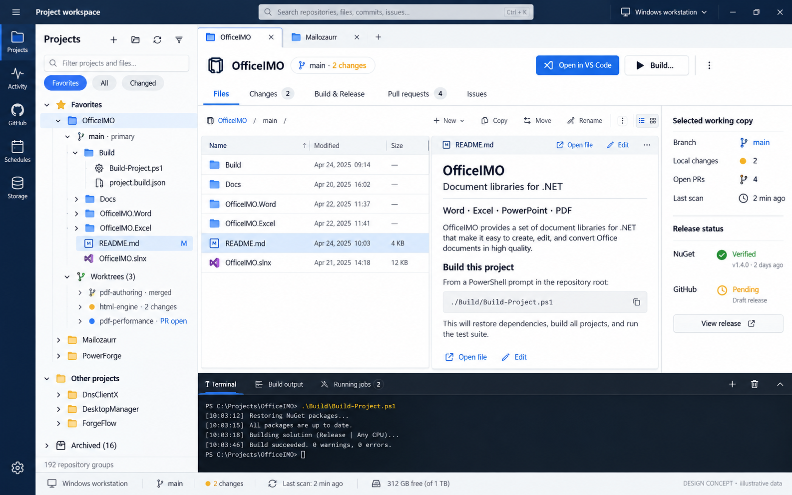
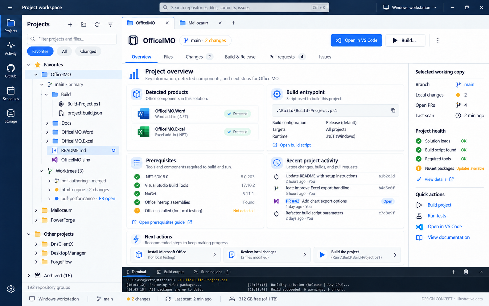
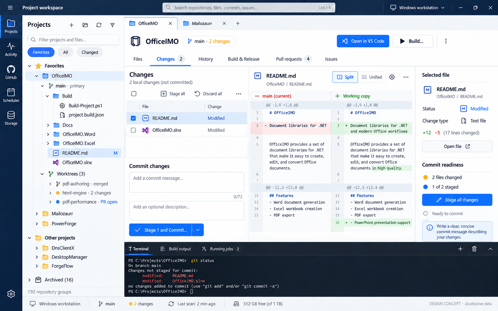
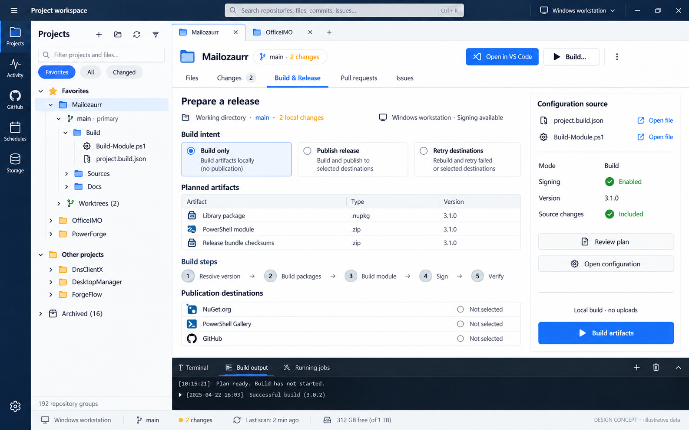
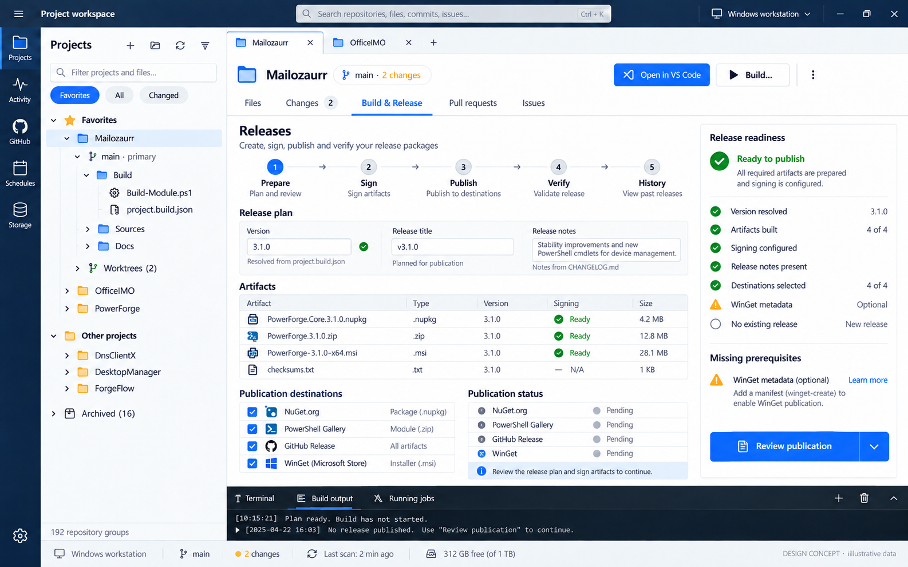
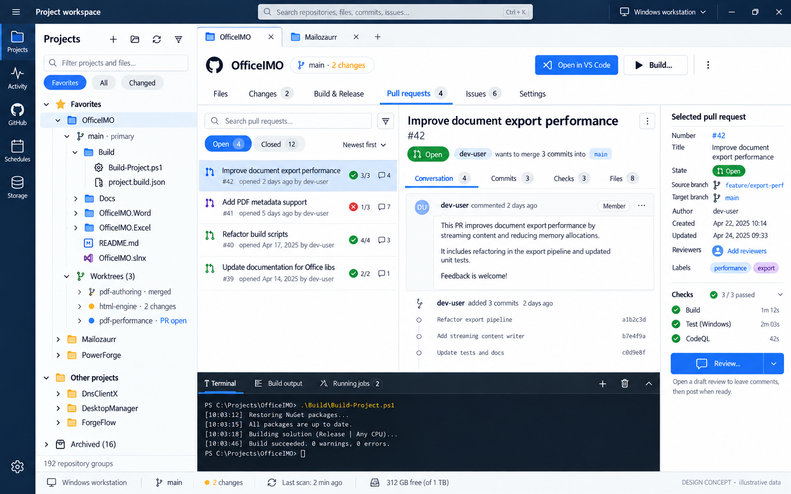
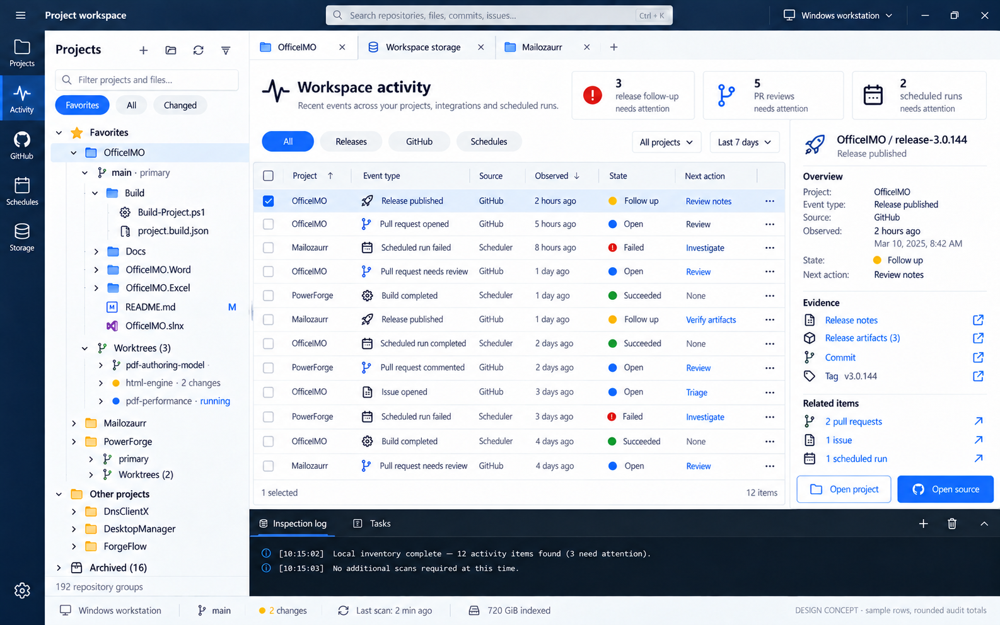
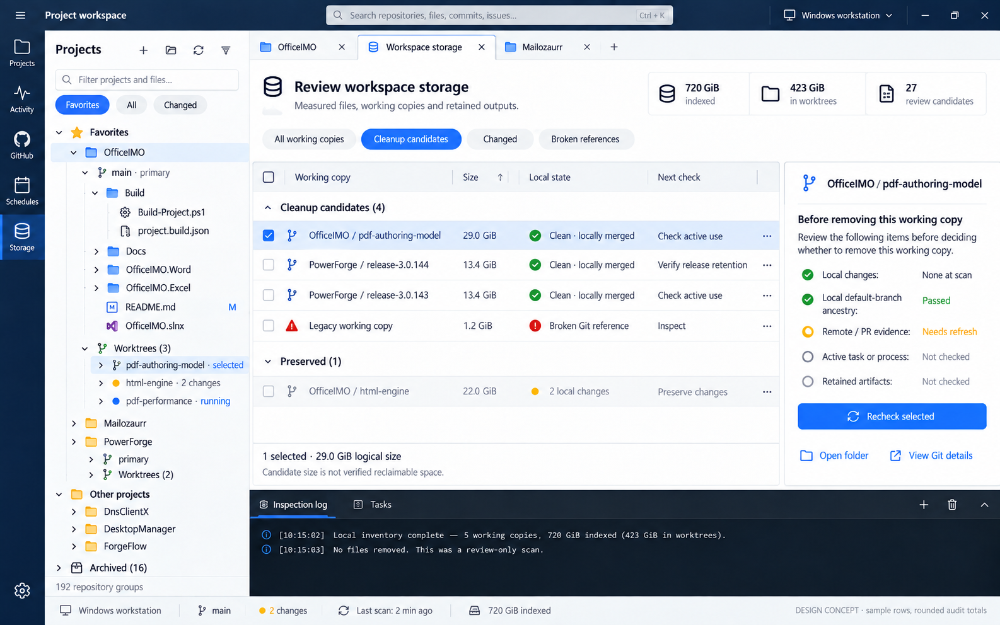

# PowerForge Studio visual review

This is the complete concept set for the Avalonia workspace: eight representative page patterns, not a mockup for every route, dialog, loading state, or viewport. The [product map](PowerForgeStudio.ProductMap.md) defines navigation and behavior. These images define visual hierarchy, spacing, typography, color, icons, tree density, and panel composition. All repository names, counts, dates, versions, paths, statuses, and output in the images are illustrative.

| Pattern | Concept | What to carry into the app |
|---|---|---|
| Workspace and files | [01](Assets/PowerForgeStudio/01-workspace.png) | Persistent project/working-copy tree, file list and preview, tabs, inspector, output dock |
| Project overview | [02](Assets/PowerForgeStudio/02-overview.png) | Project identity, detected entrypoints, prerequisites and recent evidence in compact cards |
| Changes and history | [03](Assets/PowerForgeStudio/03-changes-history.png) | Branch context, changed paths, readable diff, explicit stage and commit workflow |
| Build & Run | [04](Assets/PowerForgeStudio/04-build-run.png) | Reviewed source configuration, build-only intent, stages, artifacts and output |
| Releases | [05](Assets/PowerForgeStudio/05-releases.png) | Prepare, sign, destination review, publish, verify and saved receipts |
| Project GitHub | [06](Assets/PowerForgeStudio/06-project-github.png) | Issues, PRs, checks, discussion, changed files and draft-first actions |
| Workspace catalog | [07](Assets/PowerForgeStudio/07-activity.png) | Cross-project activity list and evidence inspector; Automations and Connections reuse the catalog pattern |
| Storage review | [08](Assets/PowerForgeStudio/08-storage.png) | Measured working copies, candidate evidence, guarded review and output |

## Concept screens

### 01 Workspace and files

### 02 Project overview

### 03 Changes and history

### 04 Build and Run

### 05 Releases

### 06 Project GitHub

### 07 Workspace Activity

### 08 Storage review

The shared visual system is a navy 70 px rail and title band, white workspace, restrained blue selection, thin blue-gray dividers, compact vector icons, a roughly 325 px tree, contextual inspector, and dark output dock. Selected repository, selected working copy, selected file, and selected workspace route need distinct indicators. Keep controls that perform an action visually different from read-only status. Wide and compact layouts use the same design system; the inspector or preview may collapse when space is limited.

## Corrections before implementation

- The concepts show `Schedules` in the rail; the implemented workspace route is **Automations**. The project tab is **Build & Run**, while **Releases** is its separate project tab. Follow the product map for route names.
- The top search and tree filter must describe their actual search scope. A project-only filter must not claim to search commits, issues, or file contents.
- Overview detection, package versions, tool readiness and recent activity come from observed sources. The Overview image does not authorize defaulting these to green or inventing a release state.
- Changes must show staged and unstaged state accurately. Any discard operation needs its own guarded workflow. A commit always uses the selected working copy and explicit user-authored message.
- Build & Run keeps Build only separate from Publish release and Retry destinations. Retry uses verified artifacts where supported; it does not silently rebuild. Artifact types come from the reviewed plan, not from the pictured example.
- The Releases image mixes illustrative package names and claims readiness while its sample output says the build has not started. The app must derive readiness from its durable checkpoints. WinGet and Microsoft Store are distinct destinations. Never display credential values.
- GitHub actions use the captured repository/item and exact PR head. A review or comment opens a draft and explicit confirmation. The picture's PR, checks, and reviewer controls are illustrative, not proof of current provider capability.
- Activity totals and states are observed provider evidence with time and source, not synthesized success claims. Automations and Connections may have unavailable or partial provider states.
- Storage sizes are logical measurements, not guaranteed reclaimable space. Broken references belong in an Inspect/Repair group. Refresh remote, active-use and retained-artifact evidence before any removal.

## Review status

- [x] Eight representative concepts have one coherent shell, tree, colors and icon treatment.
- [x] The 53-page/108-state browser gallery is superseded as an implementation checklist.
- [x] Image-model inaccuracies are called out above; the product map remains the behavior contract.
- [x] A first shared Avalonia styling pass updated the title band, project filter order, typography, chips, inspector path density and output dock; fresh wide and compact Overview, Activity and Storage renders were inspected.
- [x] Storage and Activity evidence rows now pair shared vector state cues with their text labels; Storage summary cards use the same navigation icon system.
- [x] The project tree prioritizes Build and Docs at working-copy roots; Storage evidence is aligned in the inspector, and compact Storage can scroll through the complete table above a shorter output dock.
- [x] Activity source cards now fit on one row; compact Activity keeps provider state visible while showing the first actionable rows without scrolling.
- [x] Overview names the page separately from the selected project and keeps the full working-copy path copyable without letting it dominate compact layout.
- [x] Releases now shows the captured checkpoint state above a compact five-stage guide, keeps artifact paths secondary, and emphasizes the action available at that checkpoint.
- [x] Changes uses the right panel for selected-file Git evidence and the applicable stage action instead of repeating generic working-copy labels.
- [x] Project GitHub uses the right panel for the selected issue or PR, including its observed state and PR-only head/check evidence.
- [x] Build & Run keeps the working copy and trust boundary compact, shows contract paths relative to that copy, and highlights Build after a successful inspection.
- [x] Files uses the right panel for selected file or folder metadata and a working-copy-relative path, instead of repeating generic working-copy labels.
- [x] Overview moves observed project and Git context into its inspector; compact view retains a short working-copy summary when the inspector collapses.
- [x] Releases uses a checkpoint inspector with separate artifact and receipt counts. Publication controls appear only at the relevant stage, and approval appears only after destinations are inspected; completed releases retain their target and receipt evidence without stale approval controls.
- [x] Build & Run now uses the inspector for the current working copy, detected contracts, inspection status and captured build. The result card keeps full artifact paths selectable while showing them as compact file and directory rows.
- [x] Changes keeps branch switching and creation in an expandable section so compact view shows the selected patch and staged-file list sooner; the raw patch remains selectable and scrollable.
- [x] Compare current Avalonia wide and compact renders for each pattern against this set.
- [ ] Close the remaining shell, density, inspector and output-dock differences in the running application.
- [ ] Capture final native Windows and headless evidence after the last visual change.

The 1600 × 1000 and 1050 × 720 renders have now been compared with all eight concepts. The runtime captures are test fixtures, so their project names and counts differ from the illustrative designs. Compact Changes, History, Build & Run, Activity and Storage also have scrolled captures for content below the first viewport.

| Pattern | Current rendering | Remaining visual work |
|---|---|---|
| Workspace and files | The tree, file list, preview, tabs and output dock use the shared shell; selected file metadata occupies the right panel. | Check selected-file context and editing layout in the final native pass. |
| Overview | Products, entrypoints and prerequisites now start higher; the inspector shows observed project and Git context, while compact view keeps a short summary. | Check native density and long-path interaction; do not invent recent activity or tool health. |
| Changes and history | Branch actions, changed paths, patch, commit form and selected-change context are present. Compact Changes shows more of the patch before scrolling, and the commit form remains reachable below it. | Add a shared diff presentation for Changes, History and PR review with clear additions, removals and hunk boundaries; validate compact navigation in the final native pass. |
| Build & Run | Validated contracts, reviewed local actions and the available build action are visible; the inspector follows the current working copy and captured build, while result paths fit compact rows. Recognized secret arguments are removed from planning errors. | Check a real native build with long paths and review the raw output dock at compact size. |
| Releases | The captured state and available action are clear at wide and compact sizes; the inspector separates prepared artifacts from signing, publication and verification receipts. Publication approval follows destination inspection and disappears after execution while target and receipt evidence remains. | Check the full release stage progression and saved checkpoint in the final native pass. |
| Project GitHub | Issues, PR details, checks, files and reviewed actions are functional; the context panel follows the selected item. | Reduce the empty space in the list/detail split and finish compact discussion and patch scrolling. |
| Activity catalog | Source availability, counts, filters, actionable rows and evidence remain visible. | Keep the compact inspector readable when provider explanations are long. |
| Storage | Measured sizes, candidate rows and guarded evidence align closely with the reference. | Keep long paths and safety explanations readable at compact width. |

The project inspectors now follow the selected page, while their source and safety information remains tied to observed working copies, plans and receipts. Do not fill them with illustrative values or controls that have no owner.
