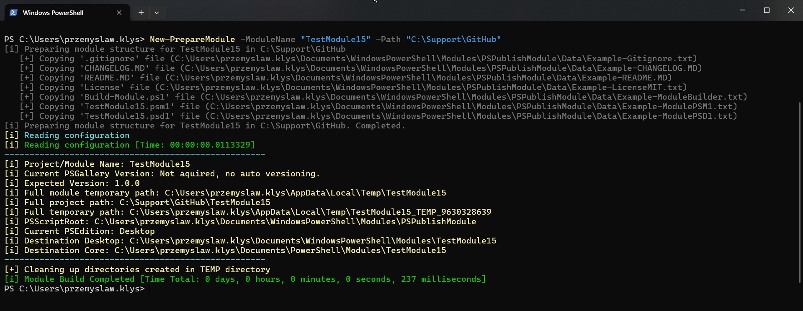
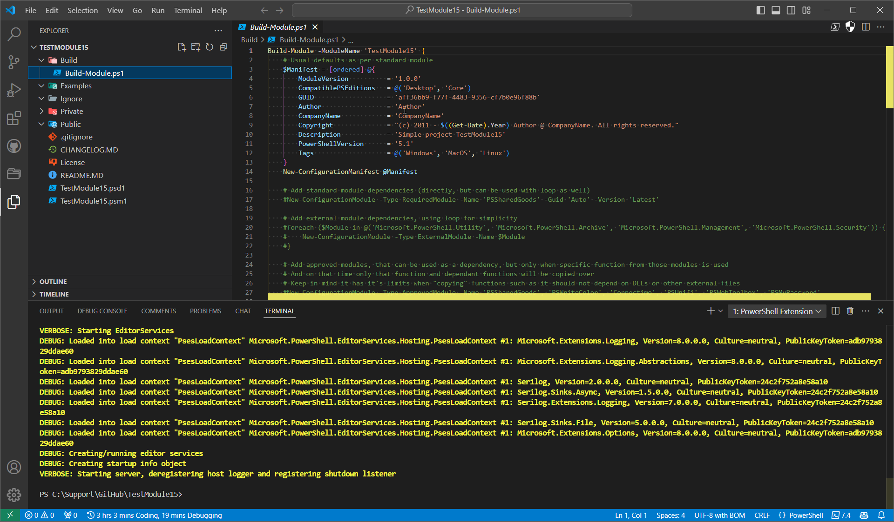

# PSPublishModule and PowerForge

PSPublishModule started as the Evotec module builder. It has grown into the PowerShell-facing surface for **PowerForge**: a build, packaging, documentation, release, private-gallery, and static-site automation toolkit used across EvotecIT projects.

Use it when you want repeatable PowerShell module builds, .NET publish matrices, MSI/MSIX/Store packaging, NuGet and PSGallery releases, generated PowerShell help, private gallery onboarding, GitHub housekeeping, or PowerForge.Web static site pipelines without rewriting the same build logic in every repository.

## Packages

### PowerShell Module

[](https://www.powershellgallery.com/packages/PSPublishModule)
[](https://www.powershellgallery.com/packages/PSPublishModule)
[](https://www.powershellgallery.com/packages/PSPublishModule)
[](https://www.powershellgallery.com/packages/PSPublishModule)

### NuGet Packages and Tools

[](https://www.nuget.org/packages/PowerForge)
[](https://www.nuget.org/packages/PowerForge)
[](https://www.nuget.org/packages/PowerForge.PowerShell)
[](https://www.nuget.org/packages/PowerForge.Build)
[](https://www.nuget.org/packages/PowerForge.Web)
[](https://www.nuget.org/packages/PowerForge.Web.Build)

### Project Information

[](https://github.com/EvotecIT/PSPublishModule/actions/workflows/BuildModule.yml)
[](https://github.com/EvotecIT/PSPublishModule/actions/workflows/dotnetpublish-tests.yml)
[](https://github.com/EvotecIT/PSPublishModule)
[](https://github.com/EvotecIT/PSPublishModule)

### Author and Social

[](https://twitter.com/PrzemyslawKlys)
[](https://evotec.xyz/hub)
[](https://www.linkedin.com/in/pklys)
[](https://evo.yt/discord)

## What It Is

PSPublishModule is the PowerShell module you install and import. PowerForge is the reusable engine underneath it. The repo also ships CLI tools:

- `powerforge` from the `PowerForge.Build` .NET tool package.
- `powerforge-web` from the `PowerForge.Web.Build` .NET tool package.

The same contracts are available from PowerShell cmdlets, JSON files, and CLI commands, so a project can start with a simple build script and later move the repeatable rules into checked-in JSON.

## Main Capabilities

| Area | What it does | Main entry points |
| --- | --- | --- |
| PowerShell module build | Builds script and binary modules, merges public/private functions, updates manifests, signs outputs, creates packed/unpacked artifacts, validates imports, runs tests, and generates help. | `Invoke-ModuleBuild`, `Build-Module`, `New-ConfigurationBuild`, `New-ConfigurationManifest`, `New-ConfigurationArtefact`, `New-ConfigurationValidation` |
| Module dependencies and isolation | Resolves required/external/approved modules, supports online dependency install, packages required modules, detects missing helpers, and imports selected modules through AssemblyLoadContext isolation profiles. | `New-ConfigurationModule`, `Get-MissingFunctions`, `Import-IsolatedModule`, `Test-IsolatedModuleProfile` |
| Documentation and delivery | Generates Markdown command docs, MAML external help, about topics, and bundled module documentation. It can also copy or render installed module docs from local files, GitHub, or Azure DevOps. | `New-ConfigurationDocumentation`, `New-ModuleAboutTopic`, `Show-ModuleDocumentation`, `Install-ModuleDocumentation`, `Install-ModuleScript` |
| Private galleries | Stores non-secret repository profiles, bootstraps feed access, and lets the managed module cmdlets use the same profile for find/save/install/update/publish. | `Set-ManagedModuleRepository`, `Get-ManagedModuleRepository`, `Initialize-ManagedModuleRepository`, `Remove-ManagedModuleRepository`, `Find-ManagedModule`, `Save-ManagedModule`, `Install-ManagedModule`, `Update-ManagedModule`, `Publish-ManagedModule` |
| Managed module lifecycle | Finds, saves, installs, updates, publishes, and maintains PowerShell modules through the managed C# engine with typed results and receipts. Benchmark tooling lives under Benchmarks for contributor evidence. | `Find-ManagedModule`, `Save-ManagedModule`, `Install-ManagedModule`, `Update-ManagedModule`, `Repair-ManagedModule`, `Publish-ManagedModule` |
| .NET publish and packaging | Builds publish matrices for apps, services, tools, bundles, plugins, MSI, MSIX, Microsoft Store packages, appinstaller files, signing, checksums, and manifests. | `New-DotNetPublishConfig`, `Invoke-DotNetPublish`, `Invoke-PowerForgeBundlePostProcess`, `Invoke-PowerForgePluginExport`, `Invoke-PowerForgePluginPack` |
| Unified release | Coordinates module artifacts, NuGet packages, tool binaries, installers, GitHub releases, staging folders, checksums, Winget manifests/submission, and release manifests from one release config. | `New-PowerForgeReleaseConfig`, `Invoke-PowerForgeRelease`, `Invoke-ProjectRelease`, `Invoke-ProjectBuild`, `powerforge release` |
| GitHub housekeeping | Prunes Actions artifacts and caches, performs runner cleanup, and provides reusable workflows/actions for cross-repo maintenance. | `powerforge github housekeeping`, `.github/workflows/powerforge-github-housekeeping.yml` |
| Static websites and API docs | Builds PowerForge.Web sites, docs, blogs, search indexes, API docs, project hubs, SEO assets, sitemaps, quality gates, audits, and deployment artifacts. | `powerforge-web build`, `powerforge-web pipeline`, `powerforge-web verify`, `powerforge-web audit`, `powerforge-web scaffold` |
| Project hygiene | Checks or fixes line endings/encoding, removes comments or project files, reads versions, and summarizes test failures. | `Get-ProjectConsistency`, `Convert-ProjectConsistency`, `Get-ProjectVersion`, `Set-ProjectVersion`, `Get-ModuleTestFailures` |

## Supported Runtimes

| Surface | Targets |
| --- | --- |
| PSPublishModule | Windows PowerShell 5.1 and PowerShell 7+ |
| PowerForge | .NET Framework 4.7.2, .NET 8, .NET 10 |
| PowerForge.PowerShell | .NET Framework 4.7.2, .NET 8, .NET 10 |
| PowerForge.Cli / `powerforge` | .NET 8 and .NET 10 |
| PowerForge.Web / `powerforge-web` | .NET 8 and .NET 10 |

## Install

Install the PowerShell module from PSGallery:

```powershell
Install-Module -Name PSPublishModule -Scope CurrentUser
```

If you are updating an older install or replacing a prerelease build, this is the usual maintainer-friendly command:

```powershell
Install-Module -Name PSPublishModule -AllowClobber -Force -SkipPublisherCheck
```

Install the CLI tools when you prefer JSON-first automation from shell scripts or CI:

```powershell
dotnet tool install --global PowerForge.Build
dotnet tool install --global PowerForge.Web.Build
```

Update later with:

```powershell
Update-Module -Name PSPublishModule
dotnet tool update --global PowerForge.Build
dotnet tool update --global PowerForge.Web.Build
```

If a production build depends on a known-good version, pin and test upgrades intentionally. PSPublishModule and PowerForge expose build/release contracts, so small parameter or manifest changes can affect automation.

## Quick Start: Build a PowerShell Module

Scaffold a starter module:

```powershell
Import-Module PSPublishModule

Build-Module -ModuleName 'MyModule' -Path 'C:\Git'
```

Build an existing module with a PowerShell DSL:

```powershell
Invoke-ModuleBuild -ModuleName 'MyModule' -Path 'C:\Git' -Settings {
    New-ConfigurationBuild -Enable
    New-ConfigurationManifest -Description 'My module' -PowerShellVersion '5.1'
    New-ConfigurationDocumentation -Enable -Path 'Docs' -PathReadme 'Docs\Readme.md' -AboutTopicsSourcePath 'Help\About'
    New-ConfigurationArtefact -Type Packed -Enable
    New-ConfigurationValidation -Enable
}
```

Common module build outputs include:

- a refreshed module manifest,
- packed and unpacked artifacts,
- generated Markdown command docs,
- generated external help XML,
- about topic docs,
- validation/test summaries,
- signed module files when signing is configured.

See [Docs/PSPublishModule.ModuleDocumentation.md](Docs/PSPublishModule.ModuleDocumentation.md) and [Module/Docs/Invoke-ModuleBuild.md](Module/Docs/Invoke-ModuleBuild.md).

## Full Module Builder Example

The quick path creates the initial module structure, manifest, and build script:

```powershell
Import-Module PSPublishModule

Build-Module -ModuleName 'MyGreatModule' -Path 'C:\Support\GitHub'
```

The scaffold creates the standard folders and starting files needed to build and publish the module.



The generated structure is intentionally boring: public/private functions, manifest, docs, tests, build script, and artifact locations are laid out in the same way across modules.



After the scaffold exists, the module can be built repeatedly with a DSL script. This is the pattern used by Evotec modules: the build script owns project-specific values, while PSPublishModule/PowerForge owns the reusable build, validation, packaging, signing, and publishing behavior.

```powershell
Build-Module -ModuleName 'MyGreatModule' -Path 'C:\Support\GitHub' {
    $Manifest = [ordered] @{
        ModuleVersion        = '1.0.0'
        CompatiblePSEditions = @('Desktop', 'Core')
        GUID                 = '330e259e-799f-415d-8247-4843127620a1'
        Author               = 'Author'
        CompanyName          = 'CompanyName'
        Copyright            = "(c) 2011 - $((Get-Date).Year) Author @ CompanyName. All rights reserved."
        Description          = 'Simple project MyGreatModule'
        PowerShellVersion    = '5.1'
        Tags                 = @('Windows', 'MacOS', 'Linux')
        ProjectUri           = 'https://github.com/CompanyName/MyGreatModule'
    }
    New-ConfigurationManifest @Manifest

    New-ConfigurationModule -Type RequiredModule -Name 'PSSharedGoods' -Guid 'Auto' -Version 'Latest'

    New-ConfigurationModule -Type ApprovedModule -Name @(
        'PSSharedGoods'
        'PSWriteColor'
        'Connectimo'
        'PSUnifi'
        'PSWebToolbox'
        'PSMyPassword'
    )

    New-ConfigurationModuleSkip -IgnoreFunctionName 'Invoke-Formatter', 'Find-Module'

    $format = [ordered] @{
        RemoveComments                              = $false
        PlaceOpenBraceEnable                        = $true
        PlaceOpenBraceOnSameLine                    = $true
        PlaceOpenBraceNewLineAfter                  = $true
        PlaceOpenBraceIgnoreOneLineBlock            = $false
        PlaceCloseBraceEnable                       = $true
        PlaceCloseBraceNewLineAfter                 = $true
        PlaceCloseBraceIgnoreOneLineBlock           = $false
        PlaceCloseBraceNoEmptyLineBefore            = $true
        UseConsistentIndentationEnable              = $true
        UseConsistentIndentationKind                = 'space'
        UseConsistentIndentationPipelineIndentation = 'IncreaseIndentationAfterEveryPipeline'
        UseConsistentIndentationIndentationSize     = 4
        UseConsistentWhitespaceEnable               = $true
        UseConsistentWhitespaceCheckInnerBrace      = $true
        UseConsistentWhitespaceCheckOpenBrace       = $true
        UseConsistentWhitespaceCheckOpenParen       = $true
        UseConsistentWhitespaceCheckOperator        = $true
        UseConsistentWhitespaceCheckPipe            = $true
        UseConsistentWhitespaceCheckSeparator       = $true
        AlignAssignmentStatementEnable              = $true
        AlignAssignmentStatementCheckHashtable      = $true
        UseCorrectCasingEnable                      = $true
    }

    New-ConfigurationFormat -ApplyTo 'OnMergePSM1', 'OnMergePSD1' -Sort None @format
    New-ConfigurationFormat -ApplyTo 'DefaultPSD1', 'DefaultPSM1' -EnableFormatting -Sort None
    New-ConfigurationFormat -ApplyTo 'DefaultPSD1', 'OnMergePSD1' -PSD1Style 'Minimal'

    New-ConfigurationDocumentation `
        -Enable `
        -PathReadme 'Docs\Readme.md' `
        -Path 'Docs' `
        -AboutTopicsSourcePath 'Help\About'

    New-ConfigurationImportModule -ImportSelf -ImportRequiredModules

    New-ConfigurationBuild `
        -Enable `
        -DeleteTargetModuleBeforeBuild `
        -MergeModuleOnBuild `
        -SignModule:$false

    New-ConfigurationArtefact `
        -Type Unpacked `
        -Enable `
        -Path "$PSScriptRoot\..\Artefacts" `
        -RequiredModulesPath "$PSScriptRoot\..\Artefacts\Modules"

    New-ConfigurationArtefact `
        -Type Packed `
        -Enable `
        -Path "$PSScriptRoot\..\Releases" `
        -IncludeTagName

    New-ConfigurationPublish `
        -Type PowerShellGallery `
        -FilePath 'C:\Support\Important\PowerShellGalleryAPI.txt' `
        -Enabled:$false

    New-ConfigurationPublish `
        -Type GitHub `
        -FilePath 'C:\Support\Important\GitHubAPI.txt' `
        -UserName 'CompanyName' `
        -Enabled:$false
}
```

The older hashtable-style configuration is still supported for compatibility, but the `New-Configuration*` DSL is the preferred style for new and actively maintained modules.

## Quick Start: Private PowerShell Galleries

Create a non-secret profile for a private NuGet-compatible module feed:

```powershell
Set-ManagedModuleRepository `
    -Name Company `
    -Provider NuGet `
    -RepositoryName CompanyModules `
    -RepositoryUri 'https://packages.company.test/nuget/v3/index.json' `
    -RepositoryPublishUri 'https://packages.company.test/nuget/v3/index.json' `
    -Trusted
```

Export/import the same settings for other users or build machines:

```powershell
Get-ManagedModuleRepository -Name Company -ExportPath .\Company.profile.json -Force
Initialize-ManagedModuleRepository -Path .\Company.profile.json -Overwrite
Initialize-ManagedModuleRepository -ProfileName Company -InstallPrerequisites
```

Use the profile with the managed module lifecycle commands:

```powershell
Find-ManagedModule -ProfileName Company -Name Company.Tools
Save-ManagedModule -ProfileName Company -Name Company.Tools -Path C:\OfflineModules
Install-ManagedModule -ProfileName Company -Name Company.Tools -Scope CurrentUser
Update-ManagedModule -ProfileName Company -Name Company.Tools
```

Publish PowerShell modules through the same profile:

```powershell
Publish-ManagedModule -Path C:\Source\Company.Tools -ProfileName Company -ApiKeyFilePath C:\Secrets\company-feed-key.txt
```

`Publish-NugetPackage` remains available for raw `.nupkg` publishing. For
module lifecycle work, prefer `Publish-ManagedModule` so package creation,
metadata validation, repository resolution, and publish behavior stay in the
managed module flow.

See [Docs/PSPublishModule.PrivateGalleries.md](Docs/PSPublishModule.PrivateGalleries.md),
[Docs/PSPublishModule.ManagedModules.Compatibility.md](Docs/PSPublishModule.ManagedModules.Compatibility.md),
and `Get-Help about_PrivateGalleries`.

## Quick Start: Managed Module Lifecycle

The managed module commands are the C# engine path for module discovery, save,
install, update, publish, and estate maintenance. They are designed to cover
common `Find-Module`, `Save-Module`, `Install-Module`, `Update-Module`, and
`Publish-Module` workflows without depending on PowerShellGet, PSResourceGet,
PackageManagement, external executables, or embedded PowerShell scripts in the
managed delivery path.

```powershell
Find-ManagedModule -Name Company.Tools -Repository PSGallery
Save-ManagedModule -Name Company.Tools -Path C:\OfflineModules -Repository PSGallery
Install-ManagedModule -Name Company.Tools -Scope CurrentUser -Repository PSGallery
Update-ManagedModule -Name Company.Tools -Repository PSGallery
Publish-ManagedModule -Path C:\Source\Company.Tools -Repository C:\Packages
```

Managed module repository profiles can be used anywhere the lifecycle commands
accept `-ProfileName`, so private/internal feeds do not need a parallel install
or update command family.

For machine-wide maintenance, use `Repair-ManagedModule` as the operator
entrypoint. `-Plan` previews the work with typed objects and the same summary
view; removing `-Plan` applies the managed install/update/save actions.

```powershell
Repair-ManagedModule -Latest -Repository PSGallery -Plan -ShowSummary
Repair-ManagedModule -Latest -Repository PSGallery -ShowSummary
```

### Benchmarks

The managed module benchmark answers a narrow question: how long does each
tool take to run the public command a user would normally run? The script in
[Benchmarks/ManagedModules](Benchmarks/ManagedModules) measures `Find`,
`Install`, and `Save` for PSScriptAnalyzer, Microsoft.Graph.Authentication,
Microsoft.Graph, Az.Accounts, and Az against Managed, ModuleFast,
PSResourceGet, and PowerShellGet where an equivalent command exists. Repair is
not included because the other tools do not expose an equivalent module-estate
repair command.

Managed is the `1.00x` baseline for each completed row. Other values show how
many times slower that tool was for the same scenario, with measured time in
parentheses. A row only deserves a speed comparison when the tool successfully
materializes the requested module graph; source/index misses and unsupported
operations should be read as compatibility notes, not slow timings.

What makes Managed fast is the install model, not simply that it uses .NET.
PowerShellGet, PackageManagement, and PSResourceGet also use compiled .NET
components. The difference is that Managed uses a purpose-built module
repository and archive pipeline instead of routing normal installs through a
generic package-provider workflow.

- Repository lookup, dependency planning, package download, extraction, caching,
  and promotion run in one operation-local engine.
- Large dependency graphs such as `Microsoft.Graph` and `Az` are resolved and
  installed concurrently instead of as one long serial provider walk.
- Duplicate dependency requests are coalesced inside the same operation. If two
  branches ask for the same package/version, one install wins and the other
  branch reuses the completed result.
- Packages are streamed directly, SHA256 is recorded, and per-run package and
  extracted-package caches avoid paying the same download/extract cost again.
- Installs stage into short hidden folders and promote atomically into the final
  versioned module path. That keeps PS 5.1 viable for deep packages such as
  `Az.MachineLearningServices` while preserving the normal installed layout.
- The same managed path runs on PS 7 and Windows PowerShell 5.1, so the 5.1
  results are not forced through older provider behavior just because the host
  is older.

ModuleFast is fast for a different reason. It is a focused installer that uses
`pwsh.gallery`, a community NuGet v2-to-v3 bridge for PowerShell Gallery using
Cloudflare Workers. That mirror is maintained outside the official PowerShell
Gallery path; the public ModuleFast and PWSHGallery repositories are under
[Justin Grote's GitHub account](https://github.com/JustinGrote). This makes
[ModuleFast](https://github.com/JustinGrote/ModuleFast) a useful speed
comparison, but not an identical source comparison. When the mirror has the full
dependency graph, ModuleFast can be very fast. When the mirror is missing a
dependency that the official Gallery resolves, the ModuleFast row should be
treated as a source/index miss rather than a managed engine failure.

Latest targeted PS 7 install rerun after the dependency fanout tuning, measured
as the median of three side-by-side runs:

| Scenario | Managed | ModuleFast | Result |
| --- | ---: | ---: | --- |
| Az.Accounts | 0.53s | 0.64s | Managed faster |
| PSScriptAnalyzer | 0.79s | 1.00s | Managed faster |
| Microsoft.Graph | 5.69s | 5.74s | Managed slightly faster |
| Microsoft.Graph.Authentication | 0.65s | 0.57s | ModuleFast slightly faster |

The full table below is a generated full-matrix snapshot. Refresh it only from
a coherent full-matrix run across the same hosts, operations, tools, and source
conditions.

<!-- managed-module-benchmark-table:start -->
| Scenario | Host | Operation | Managed | ModuleFast | PSResourceGet | PowerShellGet | Result |
| --- | --- | --- | --- | --- | --- | --- | --- |
| Az.Accounts | PowerShell 7 | Find | 1.00x (0.34s) | NotEquivalent | 0.91x (0.31s) | 1.71x (0.58s) | Managed slower than PSResourceGet |
| Az.Accounts | PowerShell 7 | Install | 1.00x (0.58s) | 2.00x (1.15s) | 2.80x (1.61s) | 10.08x (5.80s) | Managed fastest |
| Az.Accounts | PowerShell 7 | Save | 1.00x (0.63s) | NotEquivalent | 2.62x (1.66s) | 7.11x (4.51s) | Managed fastest |
| Az.Accounts | Windows PowerShell 5.1 | Find | 1.00x (0.37s) | NotEquivalent | 1.23x (0.45s) | 2.31x (0.85s) | Managed fastest |
| Az.Accounts | Windows PowerShell 5.1 | Install | 1.00x (0.77s) | NotAvailable | 2.61x (2.00s) | 7.64x (5.84s) | Managed fastest |
| Az.Accounts | Windows PowerShell 5.1 | Save | 1.00x (0.73s) | NotEquivalent | 3.23x (2.35s) | 4.73x (3.44s) | Managed fastest |
| Az | PowerShell 7 | Find | 1.00x (0.27s) | NotEquivalent | 1.35x (0.37s) | 2.81x (0.76s) | Managed fastest |
| Az | PowerShell 7 | Install | 1.00x (12.31s) | Failed | 11.21x (137.93s) | 12.46x (153.34s) | Managed fastest |
| Az | PowerShell 7 | Save | 1.00x (8.89s) | NotEquivalent | 16.54x (146.98s) | 12.70x (112.89s) | Managed fastest |
| Az | Windows PowerShell 5.1 | Find | 1.00x (0.44s) | NotEquivalent | 1.89x (0.82s) | 9.79x (4.27s) | Managed fastest |
| Az | Windows PowerShell 5.1 | Install | 1.00x (14.78s) | NotAvailable | 10.29x (152.18s) | 8.89x (131.37s) | Managed fastest |
| Az | Windows PowerShell 5.1 | Save | 1.00x (8.47s) | NotEquivalent | 17.41x (147.58s) | 16.92x (143.37s) | Managed fastest |
| Graph.Authentication | PowerShell 7 | Find | 1.00x (0.25s) | NotEquivalent | 1.28x (0.32s) | 2.35x (0.58s) | Managed fastest |
| Graph.Authentication | PowerShell 7 | Install | 1.00x (0.46s) | 1.53x (0.70s) | 3.00x (1.37s) | 9.92x (4.54s) | Managed fastest |
| Graph.Authentication | PowerShell 7 | Save | 1.00x (0.43s) | NotEquivalent | 3.79x (1.62s) | 7.89x (3.37s) | Managed fastest |
| Graph.Authentication | Windows PowerShell 5.1 | Find | 1.00x (0.25s) | NotEquivalent | 1.28x (0.32s) | 3.15x (0.78s) | Managed fastest |
| Graph.Authentication | Windows PowerShell 5.1 | Install | 1.00x (0.73s) | NotAvailable | 2.14x (1.57s) | 6.14x (4.50s) | Managed fastest |
| Graph.Authentication | Windows PowerShell 5.1 | Save | 1.00x (0.68s) | NotEquivalent | 2.17x (1.47s) | 3.64x (2.47s) | Managed fastest |
| Graph | PowerShell 7 | Find | 1.00x (0.36s) | NotEquivalent | 1.01x (0.37s) | 2.29x (0.83s) | Managed fastest |
| Graph | PowerShell 7 | Install | 1.00x (9.17s) | 0.57x (5.22s) | 18.96x (173.93s) | 9.60x (88.03s) | Managed slower than ModuleFast |
| Graph | PowerShell 7 | Save | 1.00x (6.93s) | NotEquivalent | 8.92x (61.79s) | 9.88x (68.47s) | Managed fastest |
| Graph | Windows PowerShell 5.1 | Find | 1.00x (0.23s) | NotEquivalent | 1.30x (0.29s) | 5.08x (1.14s) | Managed fastest |
| Graph | Windows PowerShell 5.1 | Install | 1.00x (6.10s) | NotAvailable | 9.01x (54.98s) | 12.91x (78.79s) | Managed fastest |
| Graph | Windows PowerShell 5.1 | Save | 1.00x (5.16s) | NotEquivalent | 11.42x (58.96s) | 15.39x (79.45s) | Managed fastest |
| PSScriptAnalyzer | PowerShell 7 | Find | 1.00x (0.48s) | NotEquivalent | 1.09x (0.53s) | 7.32x (3.53s) | Managed fastest |
| PSScriptAnalyzer | PowerShell 7 | Install | 1.00x (1.52s) | 1.59x (2.43s) | 1.83x (2.78s) | 5.39x (8.21s) | Managed fastest |
| PSScriptAnalyzer | PowerShell 7 | Save | 1.00x (0.90s) | NotEquivalent | 2.53x (2.29s) | 4.20x (3.79s) | Managed fastest |
| PSScriptAnalyzer | Windows PowerShell 5.1 | Find | 1.00x (0.35s) | NotEquivalent | 2.91x (1.01s) | 7.29x (2.52s) | Managed fastest |
| PSScriptAnalyzer | Windows PowerShell 5.1 | Install | 1.00x (1.37s) | NotAvailable | 1.68x (2.30s) | 4.28x (5.87s) | Managed fastest |
| PSScriptAnalyzer | Windows PowerShell 5.1 | Save | 1.00x (0.98s) | NotEquivalent | 2.60x (2.55s) | 3.69x (3.62s) | Managed fastest |
<!-- managed-module-benchmark-table:end -->

Refresh the table with:

```powershell
pwsh -NoLogo -NoProfile -ExecutionPolicy Bypass -File .\Benchmarks\ManagedModules\Measure-ManagedModuleBenchmark.ps1 -RepeatCount 1
powershell.exe -NoLogo -NoProfile -ExecutionPolicy Bypass -File .\Benchmarks\ManagedModules\Measure-ManagedModuleBenchmark.ps1 -RepeatCount 1 -Append
pwsh -NoLogo -NoProfile -ExecutionPolicy Bypass -File .\Benchmarks\ManagedModules\Update-ManagedModuleBenchmarkReadme.ps1 -ResultPath .\Ignore\Benchmarks\ManagedModules\managed-module-benchmark.csv
```

Native `Install-Module` and `Install-PSResource` install into the user module
location. Include those install rows only in a disposable benchmark profile or
VM by passing `-AllowUserProfileInstall`.

See [Docs/PSPublishModule.ManagedModules.Compatibility.md](Docs/PSPublishModule.ManagedModules.Compatibility.md)
for the switching matrix, [Docs/PSPublishModule.ManagedModules.Roadmap.md](Docs/PSPublishModule.ManagedModules.Roadmap.md)
for the remaining parity and documentation gates, and [Benchmarks/ManagedModules/README.md](Benchmarks/ManagedModules/README.md)
for the exact benchmark commands.

## Quick Start: .NET Publish and Packaging

Scaffold a JSON config:

```powershell
New-DotNetPublishConfig -ProjectRoot '.' -PassThru
```

Plan and run:

```powershell
Invoke-DotNetPublish -ConfigPath '.\powerforge.dotnetpublish.json' -Validate
Invoke-DotNetPublish -ConfigPath '.\powerforge.dotnetpublish.json' -Plan
Invoke-DotNetPublish -ConfigPath '.\powerforge.dotnetpublish.json' -ExitCode
```

The same flow is available through the CLI:

```powershell
powerforge dotnet scaffold --project-root . --output json
powerforge dotnet publish --config .\powerforge.dotnetpublish.json --plan
powerforge dotnet publish --config .\powerforge.dotnetpublish.json --output json
```

The DotNet publish engine can produce publish folders, zip files, service scripts, bundle layouts, plugin folders/packages, generated MSI authoring, MSI outputs, MSIX/Store packages, appinstaller files, manifests, checksums, and signing reports.

See [Docs/PSPublishModule.DotNetPublish.Quickstart.md](Docs/PSPublishModule.DotNetPublish.Quickstart.md).

## Quick Start: Unified Release

Generate a starter release config:

```powershell
New-PowerForgeReleaseConfig -ProjectRoot . -PassThru
```

Plan or run the release:

```powershell
Invoke-PowerForgeRelease -ConfigPath .\Build\release.json -Plan
Invoke-PowerForgeRelease -ConfigPath .\Build\release.json
```

CLI equivalent:

```powershell
powerforge release --config .\Build\release.json --plan
```

The unified release engine is designed for repositories that need several outputs at once: module packages, NuGet packages, portable tools, installers, GitHub release uploads, Winget manifests/submission, checksums, and categorized upload-ready staging folders.

See [Docs/PSPublishModule.ProjectBuild.md](Docs/PSPublishModule.ProjectBuild.md).

## Quick Start: PowerForge.Web

PowerForge.Web is the static-site engine in this repository. It is used for documentation sites, API reference portals, project hubs, blog/news content, search, SEO assets, sitemaps, quality gates, and CI-friendly audits.

Create or standardize a site:

```powershell
powerforge-web scaffold --out .\Website --name "My Site" --base-url "https://example.com" --engine scriban
```

Run a local pipeline:

```powershell
powerforge-web pipeline --config .\pipeline.json --mode dev
```

Run CI-style gates locally:

```powershell
powerforge-web pipeline --config .\pipeline.json --mode ci
```

Recommended site contracts include:

- explicit `Features` in `site.json`,
- `pipeline.json` with dev and CI modes,
- committed `.powerforge/verify-baseline.json`,
- committed `.powerforge/audit-baseline.json`,
- strict CI gates with `failOnNewWarnings` and `failOnNewIssues`,
- a theme manifest with feature contracts.

See [Docs/PowerForge.Web.WebsiteStarter.md](Docs/PowerForge.Web.WebsiteStarter.md), [Docs/PowerForge.Web.QualityGates.md](Docs/PowerForge.Web.QualityGates.md), and [Docs/PowerForge.Web.Roadmap.md](Docs/PowerForge.Web.Roadmap.md).

## GitHub Housekeeping

PowerForge can clean GitHub Actions artifacts, caches, and runner workspace pressure with safe dry-run defaults:

```powershell
powerforge github artifacts prune --name "test-results*,coverage*,github-pages"
powerforge github caches prune --key "ubuntu-*,windows-*" --keep 1 --max-age-days 14
powerforge github runner cleanup --apply --min-free-gb 20
powerforge github housekeeping --config .\.powerforge\github-housekeeping.json --apply
```

Reusable workflow example:

```yaml
permissions:
  contents: read
  actions: write

jobs:
  housekeeping:
    uses: EvotecIT/PSPublishModule/.github/workflows/powerforge-github-housekeeping.yml@main
    with:
      config-path: ./.powerforge/github-housekeeping.json
    secrets: inherit
```

## Command Families

PSPublishModule exports commands in these families:

- `Invoke-*`: run build, test, publish, release, plugin, and repository workflows.
- `New-Configuration*`: create DSL objects for module, .NET publish, release, installer, signing, documentation, validation, and compatibility configuration.
- `New-*Config`: scaffold JSON configuration files.
- `Get-*` / `Test-*`: inspect module metadata, repository profiles, compatibility, project consistency, versions, isolated module profiles, and test failures.
- `Find-*` / `Save-*` / `Install-*` / `Update-*` / `Repair-*`: manage module discovery, materialization, installation, update, repair, docs/scripts, and managed repository profiles.
- `Publish-*` / `Send-*`: publish NuGet packages and GitHub release assets.
- `powerforge`: JSON-first CLI for release, .NET publish, GitHub housekeeping, plugin export/pack, bundle post-process, and related automation.
- `powerforge-web`: static-site and API-docs CLI.

Generated command reference lives in [Module/Docs/Readme.md](Module/Docs/Readme.md).

## Repository Layout

| Path | Purpose |
| --- | --- |
| `PSPublishModule/` | Binary PowerShell module cmdlets. |
| `PowerForge/` | Host-neutral build, release, packaging, and workflow engine. |
| `PowerForge.PowerShell/` | PowerShell runtime adapters, module build execution, help extraction, signing, Pester, and repository tooling. |
| `PowerForge.Cli/` | `powerforge` command-line tool. |
| `PowerForge.Web/` | Static-site, API-docs, search, SEO, audit, and verification engine. |
| `PowerForge.Web.Cli/` | `powerforge-web` command-line tool. |
| `PowerForgeStudio.*` | Current PowerForge Studio experiments and hosts. |
| `Module/` | Packaged PSPublishModule output, generated command docs, external help, tests, and module build script. |
| `Docs/` | Durable design notes, quickstarts, roadmaps, and workflow documentation. |
| `Schemas/` | JSON schemas for PowerForge configs. |
| `Build/` | Repo release/build entrypoints and release configuration. |

## Build This Repository

Run the full solution tests:

```powershell
dotnet test .\PSPublishModule.sln -c Release
```

Run the module build:

```powershell
.\Module\Build\Build-Module.ps1
```

Run the unified release plan:

```powershell
.\Build\Build-Project.ps1 -Plan
```

Build release artifacts:

```powershell
.\Build\Build-Project.ps1
```

Build only the CLI tools:

```powershell
.\Build\Build-Project.ps1 -ToolsOnly
```

## Documentation

Start here:

- [Docs/PSPublishModule.DotNetPublish.Quickstart.md](Docs/PSPublishModule.DotNetPublish.Quickstart.md)
- [Docs/PSPublishModule.ProjectBuild.md](Docs/PSPublishModule.ProjectBuild.md)
- [Docs/PSPublishModule.ModuleDocumentation.md](Docs/PSPublishModule.ModuleDocumentation.md)
- [Docs/PSPublishModule.PrivateGalleries.md](Docs/PSPublishModule.PrivateGalleries.md)
- [Docs/PSPublishModule.ManagedModules.Compatibility.md](Docs/PSPublishModule.ManagedModules.Compatibility.md)
- [Docs/PSPublishModule.ManagedModules.Roadmap.md](Docs/PSPublishModule.ManagedModules.Roadmap.md)
- [Benchmarks/ManagedModules/README.md](Benchmarks/ManagedModules/README.md)
- [Docs/PSPublishModule.ModuleIsolation.md](Docs/PSPublishModule.ModuleIsolation.md)
- [Docs/PowerForge.Web.WebsiteStarter.md](Docs/PowerForge.Web.WebsiteStarter.md)
- [Docs/PowerForge.Web.QualityGates.md](Docs/PowerForge.Web.QualityGates.md)
- [Docs/PowerForge.Web.Roadmap.md](Docs/PowerForge.Web.Roadmap.md)
- [Docs/PowerForgeStudio.Runbook.md](Docs/PowerForgeStudio.Runbook.md)
- [Module/Docs/Readme.md](Module/Docs/Readme.md)

## Support This Project

If PSPublishModule or PowerForge saves you time, sponsorship helps keep the project maintained and improving:

- [Become a sponsor via GitHub Sponsors](https://github.com/sponsors/PrzemyslawKlys)
- [Support via PayPal](https://paypal.me/PrzemyslawKlys)

Sponsorship is optional. The project remains open-source and available for everyone.

## License

PSPublishModule and PowerForge are released under the license in [LICENSE](LICENSE).
